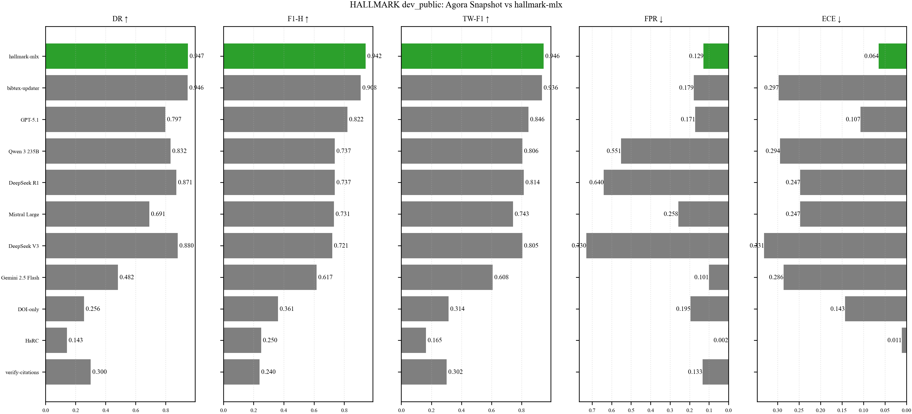

# hallmark-mlx

`hallmark-mlx` is a Mac-native research scaffold for training and evaluating small tool-using models that verify citations before answering. The project is designed around Apple Silicon, MLX LoRA fine-tuning, structured verification traces, and benchmark-oriented evaluation against citation hallucination tasks such as HALLMARK.

## Motivation

Citation errors are not just formatting problems. In research writing workflows they can silently become:

- fabricated references,
- broken BibTeX entries,
- unsupported claims,
- preprints cited as if they were published versions,
- or plausible but incorrect bibliographic metadata.

This repository treats citation verification as a grounded decision problem rather than a memorization problem. The target behavior is not "know whether the citation is true from model weights." The target behavior is:

1. parse the input,
2. identify ambiguity and likely failure modes,
3. decide which verification actions to run,
4. use external tools and APIs,
5. compare candidate matches,
6. abstain when evidence is insufficient,
7. then emit a calibrated verification verdict.

## Research Framing

The central object in this project is a structured verification trace. Training data is expected to capture intermediate decisions such as suspected issues, proposed queries, chosen tools, summarized tool outputs, candidate rankings, and final decisions. This makes the project suitable for work on:

- tool-using policy learning,
- citation hallucination detection,
- abstention and confidence calibration,
- benchmark contamination control,
- reproducible comparison between prompting and fine-tuning,
- and reliability-oriented research artifacts for academic writing pipelines.

## Why External Tools Matter

Bibliographic truth is not a stable latent fact stored inside a model. It is often resolved by interacting with systems such as:

- BibTeX Updater,
- Crossref,
- OpenAlex,
- DBLP,
- ACL Anthology,
- Semantic Scholar,
- local bibliography files,
- and benchmark-provided entry identifiers.

`hallmark-mlx` therefore separates the project into a policy layer, a tool-execution layer, and a finalization layer. The policy is responsible for deciding what to do next. The tools are responsible for evidence collection. The finalizer is responsible for conservative, evidence-aware verdict generation.

## Why MLX on Apple Silicon

The default local training path is MLX LoRA so experiments can be run directly on Apple Silicon machines without treating the Mac as a second-class environment. The code keeps MLX-specific logic behind a modular boundary so the project can later swap in a different fine-tuning backend if needed.

The repository also supports a repo-native Weco frontier loop for budget-aware policy optimization without making Weco a hard dependency of the initial scaffold.

## Repository Scope

This scaffold includes:

- a typed Python package under `src/hallmark_mlx/`,
- schema models for trace-based verification,
- a small CLI for dataset building, training, inference, evaluation, and BibTeX checking,
- wrappers for BibTeX Updater, Crossref, OpenAlex, DBLP, ACL Anthology, and Semantic Scholar,
- contamination-aware dataset utilities,
- HALLMARK-style prediction serialization,
- placeholder MLX LoRA planning hooks,
- scripts for local Mac workflows,
- and tests for the core trace and evaluation contracts.

The scaffold does not yet include:

- a production MLX decoder that emits verification traces from a model,
- benchmark-specific data loaders for the full HALLMARK release,
- or a finished training corpus.

Those are intentional next implementation steps rather than hidden mocks.

## Project Layout

```text
hallmark-mlx/
├── configs/
├── docs/
├── scripts/
├── src/hallmark_mlx/
│   ├── data/
│   ├── eval/
│   ├── inference/
│   ├── tools/
│   ├── training/
│   └── utils/
└── tests/
```

## Installation

### Recommended
```bash
uv sync --extra dev --extra mlx --extra weco
```

### Minimal
```bash
python -m pip install -e ".[dev]"
```

### Mac Notes

The repository is structured for Apple Silicon first. `scripts/setup_mac.sh` installs the local tooling expected for MLX-oriented experimentation with Qwen checkpoints. Budget-aware Weco optimization is documented in `docs/weco.md`.

## Quick Start

Build a contamination-aware trace dataset:

```bash
hallmark-mlx build-dataset \
  --config configs/base.yaml \
  --input-path data/raw/traces.jsonl \
  --output-dir data/processed
```

Run the BibTeX checker wrapper:

```bash
hallmark-mlx check-bib references.bib --strict
```

Plan or launch an MLX LoRA run:

```bash
hallmark-mlx train --config configs/train_qwen_1_5b.yaml
```

The default training config now uses `Qwen/Qwen2.5-1.5B-Instruct`. An alternate larger baseline remains available in `configs/train_qwen_3b.yaml`.

Training now defaults to `training.example_format: tool_transcript_steps`. The raw reviewed corpus still stores full chains, but the trainer explodes each full chain into stepwise supervision targets so the model sees:

- user task input,
- assistant tool call,
- tool observation JSON,
- further assistant tool calls if needed,
- and a final assistant decision JSON block.

The tokenizer's chat template still owns role-formatting tokens. The repository uses the model-native `<tool_call>...</tool_call>` delimiters and keeps tool observations plus final decisions as compact JSON so the protocol remains explicit without inventing unsupported pseudo-special tokens.

The default inference config in `configs/base.yaml` uses a deterministic `warm_start` policy backend. This is a bootstrapping path for seed-trace generation: it parses the input heuristically, proposes tool calls, runs the tool layer, and writes a structured trace you can review and later promote into training JSONL.

Example:

```bash
hallmark-mlx infer \
  --config configs/base.yaml \
  --raw-input "Vaswani et al. Attention Is All You Need. NeurIPS 2017." \
  --output-path artifacts/examples/attention_trace.json
```

Those saved traces are intended to become curated supervision targets, not unreviewed auto-labels.

For batch bootstrapping from a JSONL file of `VerificationInput` records:

```bash
hallmark-mlx bootstrap-traces \
  --config configs/base.yaml \
  --input-path data/raw/verification_inputs.jsonl \
  --output-path data/raw/seed_traces.jsonl
```

Format predictions for HALLMARK-style evaluation:

```bash
hallmark-mlx eval \
  --config configs/eval_hallmark.yaml \
  --predictions artifacts/predictions.jsonl \
  --gold data/hallmark/dev_public.jsonl
```

## Example Training Trace JSON

This repository is organized around traces like the following:

```json
{
  "policy_version": "v0",
  "input": {
    "record_id": "trace-001",
    "input_type": "raw_citation_string",
    "raw_input": "Vaswani et al. Attention Is All You Need. NeurIPS 2017."
  },
  "parsed_fields": {
    "title": "Attention Is All You Need",
    "authors": ["Ashish Vaswani", "Noam Shazeer"],
    "year": 2017,
    "venue": "NeurIPS"
  },
  "suspected_issues": [
    {
      "code": "missing_doi",
      "rationale": "No DOI is available in the raw citation string."
    }
  ],
  "proposed_query": {
    "query": "Attention Is All You Need Vaswani 2017 NeurIPS",
    "purpose": "resolve_canonical_record"
  },
  "next_action": "query_crossref",
  "tool_calls": [
    {
      "tool": "crossref",
      "action": "search_works",
      "arguments": {
        "query": "Attention Is All You Need Vaswani 2017 NeurIPS",
        "rows": 5
      }
    }
  ],
  "final_decision": {
    "verdict": "verified",
    "confidence": 0.92,
    "rationale": "Crossref returned the expected title, author list, year, and DOI."
  }
}
```

## Example Inference Output

The inference boundary expects a structured result, not only a label:

```json
{
  "verdict": "abstain",
  "confidence": 0.41,
  "rationale": "Candidate metadata conflicts across sources.",
  "abstain_reason": "ambiguous_candidate_set",
  "tool_consensus": {
    "supporting_tools": ["crossref", "openalex"],
    "conflicting_tools": ["semantic_scholar"]
  }
}
```

## Example HALLMARK Prediction JSONL Line

When benchmark keys are available, the adapter writes one JSON object per entry:

```json
{"bibtex_key":"a3f9c2b1d4e76f85","label":"HALLUCINATED","confidence":0.87,"reason":"DOI does not resolve and no matching published record was found.","subtest_results":{"doi_resolves":false},"api_sources_queried":["crossref","semantic_scholar"],"wall_clock_seconds":1.2,"api_calls":3}
```

For real HALLMARK evaluation, use the exact `entry.bibtex_key` from the benchmark loader. Deterministic hashes produced from local inputs are for local dry runs only.

## Baseline Experimental Loop

The repository is meant to support side-by-side comparisons between:

- baseline prompting without tools,
- prompting with external verification tools,
- MLX LoRA fine-tuning on trace data,
- and later Weco-guided prompt or adapter optimization.

## Benchmark Snapshot

The public-facing benchmark artifacts in this repository use official HALLMARK splits only.
Internal Weco model-selection splits remain in the codebase for optimization, but they are
not presented as benchmark results.

The current official benchmark artifacts are tracked in:

- `docs/reports/hallmark_submission_readiness.md` for the public leaderboard snapshot
- `docs/reports/hallmark_official_splits.md` for the official split-by-split report



That comparison loop is intentionally explicit so benchmark gains can be traced to grounded tool use rather than memorized bibliographic answers.

## Scientific Rigor

The data utilities and docs explicitly address:

- DOI and citation-family grouping,
- train/valid/test separation by citation family,
- private holdout handling,
- contamination checks against benchmark entries,
- keeping benchmark labels distinct from retrieval evidence,
- and avoiding evaluation shortcuts such as title leakage.

## Roadmap

Near-term priorities:

- implement the MLX trace decoder boundary,
- connect real training data ingestion,
- add benchmark-specific importers for HALLMARK,
- tighten BibTeX correction logic around BibTeX Updater reports,
- and calibrate abstention behavior under ambiguous evidence.

## Limitations

- The MLX training adapter launches the real `python -m mlx_lm lora ...` CLI, but successful runs still depend on realistic dataset size and strict protocol supervision.
- The inference runner requires a real policy backend that emits structured traces. No synthetic fallback policy is shipped.
- Public API wrappers are minimal and focused on normalization, not exhaustive service coverage.
- HALLMARK compatibility is format-level in this scaffold; benchmark data ingestion and leaderboard replication remain follow-on work.

## Related Work and Dependencies

- [rpatrik96/hallmark](https://github.com/rpatrik96/hallmark)
- [rpatrik96/bibtexupdater](https://github.com/rpatrik96/bibtexupdater)
- [ml-explore/mlx-lm](https://github.com/ml-explore/mlx-lm)

## License

This scaffold is prepared as an open-source research engineering repository. Add or update the project license before publication if your distribution requirements differ.
