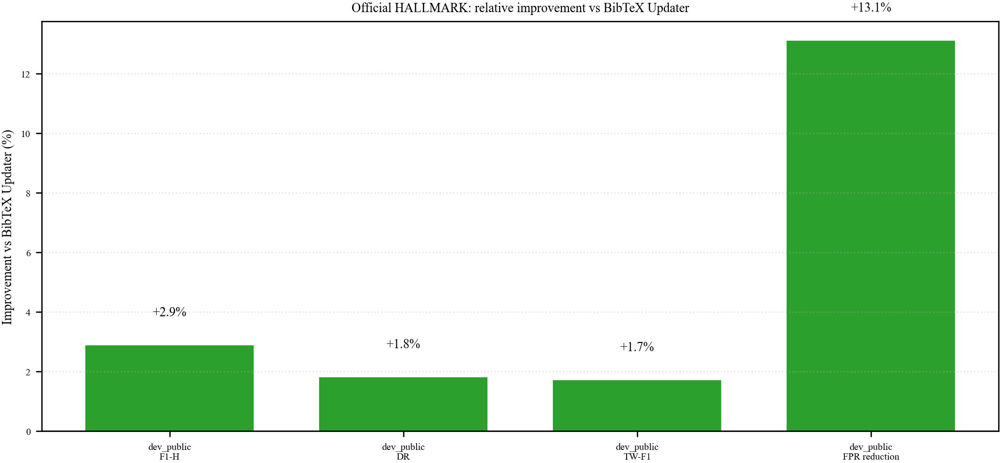

<div align="center">

# hallmark-mlx

Mac-native citation verification research on Apple Silicon with MLX, tool use, and official HALLMARK benchmarking.

[](https://github.com/SebastianBoehler/hallmark-mlx/actions/workflows/ci.yml)
[](LICENSE)
[](pyproject.toml)

</div>

`hallmark-mlx` is a research-oriented repository for building citation verification systems that use external scholarly tools before making a judgment. The project is optimized for Apple Silicon and MLX LoRA workflows, but the evaluation and reporting stack is general enough to support broader experimentation.

## What It Does

The repository is built around a simple idea: bibliographic truth should come from evidence, not from memorized model weights.

Core capabilities:

- structured verification traces for training and debugging
- tool wrappers for sources like BibTeX Updater, Crossref, OpenAlex, DBLP, ACL Anthology, arXiv, and Semantic Scholar
- MLX LoRA training flows for small Qwen-based tool-using policies
- deterministic controller and finalizer paths for benchmark-facing runs
- official HALLMARK split runners and report generation
- reproducible release bundles for datasets and LoRA adapters

## Why This Exists

Citation failures are not limited to formatting issues. In practice they include:

- fabricated references
- swapped or partial author lists
- wrong or nonexistent venues
- preprints cited as published papers
- plausible-looking but incorrect metadata

This repository treats citation verification as a grounded decision problem:

1. parse the input
2. decide which verification actions to run
3. collect evidence from external tools
4. compare candidate records
5. abstain when needed
6. emit a calibrated verdict

## Project Structure

```text
hallmark-mlx/
├── configs/
├── docs/
├── scripts/
├── skills/
├── src/hallmark_mlx/
│   ├── eval/
│   ├── inference/
│   ├── release/
│   ├── tools/
│   └── training/
├── tests/
└── .lab-book/
```

## Installation

Recommended:

```bash
uv sync --extra dev --extra mlx --extra weco
uv run pre-commit install
```

If you are not on Apple Silicon, skip the `mlx` extra:

```bash
uv sync --extra dev --extra weco
uv run pre-commit install
```

## Quick Start

Build a trace dataset:

```bash
hallmark-mlx build-dataset \
  --config configs/base.yaml \
  --input-path data/raw/traces.jsonl \
  --output-dir data/processed
```

Run the BibTeX checker wrapper:

```bash
hallmark-mlx check-bib references.bib --strict
```

Train the canonical kept 1.5B policy:

```bash
hallmark-mlx train --config configs/train_qwen_1_5b_kept.yaml
```

Run a tracked internal policy eval:

```bash
hallmark-mlx eval-policy \
  --config configs/train_qwen_1_5b_kept.yaml \
  --input-path data/weco/hallmark_dev_compare32_gold_traces.jsonl \
  --output-path artifacts/confirm_qwen_kept_compare32_metrics.json
```

## Benchmarking

Public benchmark claims in this repository are based on official HALLMARK splits only:

- `dev_public`
- `test_public`
- `stress_test`

Internal Weco splits such as `search64` and `compare32` remain in the codebase for model selection, but they are not presented as public benchmark results.

Key benchmark artifacts:

- [docs/reports/hallmark_official_splits.md](docs/reports/hallmark_official_splits.md)
- [docs/reports/hallmark_submission_readiness.md](docs/reports/hallmark_submission_readiness.md)
- [docs/figures/hallmark_official_vs_bibtexupdater.png](docs/figures/hallmark_official_vs_bibtexupdater.png)



## Reproducibility

The repository includes a repo-local skill for other coding agents:

- [skills/hallmark-mlx-repro/SKILL.md](skills/hallmark-mlx-repro/SKILL.md)

Use it to:

- rerun kept training configs
- compare the 1.5B and 3B 4-bit Mac-viable models
- refresh confirmed benchmark reports and figures
- prepare Hugging Face release bundles

The project also keeps a lightweight lab book:

- [.lab-book/README.md](.lab-book/README.md)

Use it for dated notes on experiments, benchmark reruns, Weco settings, and promotion decisions.

## Release Artifacts

HF-ready dataset and model bundles can be prepared with:

```bash
uv run python scripts/prepare_hf_release.py
```

The current release bundle root is:

- `artifacts/hf_release/qwen25_1_5b_kept`

## Development

Lint and test:

```bash
uv run ruff check .
uv run pytest
```

Refresh benchmark reports from the confirmed official reruns:

```bash
PYTHONPATH=src uv run python scripts/refresh_confirmed_benchmarks.py
```

Pre-commit currently runs:

- `ruff check --fix`
- `ruff format`
- trailing whitespace cleanup
- end-of-file normalization

## Contributing

See [CONTRIBUTING.md](CONTRIBUTING.md) for setup, style, benchmark rules, and PR expectations.

## Related Projects

- [HALLMARK](https://github.com/rpatrik96/hallmark)
- [BibTeX Updater](https://github.com/rpatrik96/bibtexupdater)
- [mlx-lm](https://github.com/ml-explore/mlx-lm)

## License

This project is released under the [MIT License](LICENSE).
